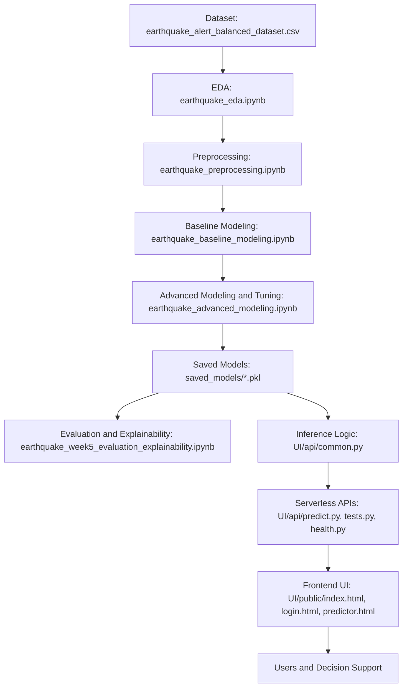

# ImpactSense - PPT Slides Content

## Slide 1: Problem Statement
- Earthquake alerts are often difficult to interpret quickly in high-pressure response situations.
- Raw seismic parameters (magnitude, depth, CDI, MMI, significance) do not directly communicate risk severity to non-specialist operators.
- Teams need a fast, visual, and reliable decision-support interface that converts seismic inputs into actionable alert categories.

## Slide 2: Proposed Solution
- Build an ML-driven Earthquake Impact Predictor that maps seismic inputs to alert classes: Green, Yellow, Orange, Red.
- Use tuned classification models trained on processed earthquake data and deploy the best-performing model for inference.
- Provide a retro-style web interface with:
  - input validation and clamping,
  - probability map by class,
  - impact score (0-100),
  - risk level output,
  - visual intensity feedback (shake effect).

## Slide 3: Tech Stack
- Data and Modeling: Python, pandas, numpy, scikit-learn, xgboost, shap, joblib.
- Backend (Local): Flask app in UI/app.py.
- Backend (Deployment): Vercel serverless Python endpoints in UI/api.
- Frontend: Static HTML/CSS/JavaScript in UI/public.
- Deployment and Routing: Vercel with vercel.json.
- Artifacts: Pickle models in saved_models.

## Slide 4: Workflow Diagram

## Slide 5: Feasibility and Viability
- Technical Feasibility:
  - Complete pipeline already implemented from data prep to deployment.
  - Saved model artifacts and API endpoints are available and integrated.
  - Input sanitization and edge-case tests improve runtime reliability.
- Operational Viability:
  - Lightweight deployment model (static frontend + serverless backend).
  - Low infrastructure overhead and easy maintenance.
  - Easy extension for additional features or model upgrades.
- Risk Considerations:
  - Model predictions depend on training data quality and representativeness.
  - Should be used as a decision-support tool, not a sole warning authority.

## Slide 6: Impact and Benefits
- Faster interpretation of seismic events through intuitive class-color outputs.
- Better decision support with impact score and risk level in a single view.
- Improved robustness via validation, clamping, and edge-case testing.
- Better communication across technical and non-technical users.
- Reusable modular architecture for future disaster analytics modules.

## Slide 7: Conclusion
- ImpactSense demonstrates an end-to-end ML-to-deployment workflow for earthquake impact prediction.
- The project converts complex seismic measurements into actionable risk outputs using a deployable web system.
- Current production architecture supports both local Flask execution and Vercel serverless deployment.
- Live Website Link: https://your-vercel-project-url.vercel.app
- Repository: https://github.com/Narayanan-D-05/ImpactSense
