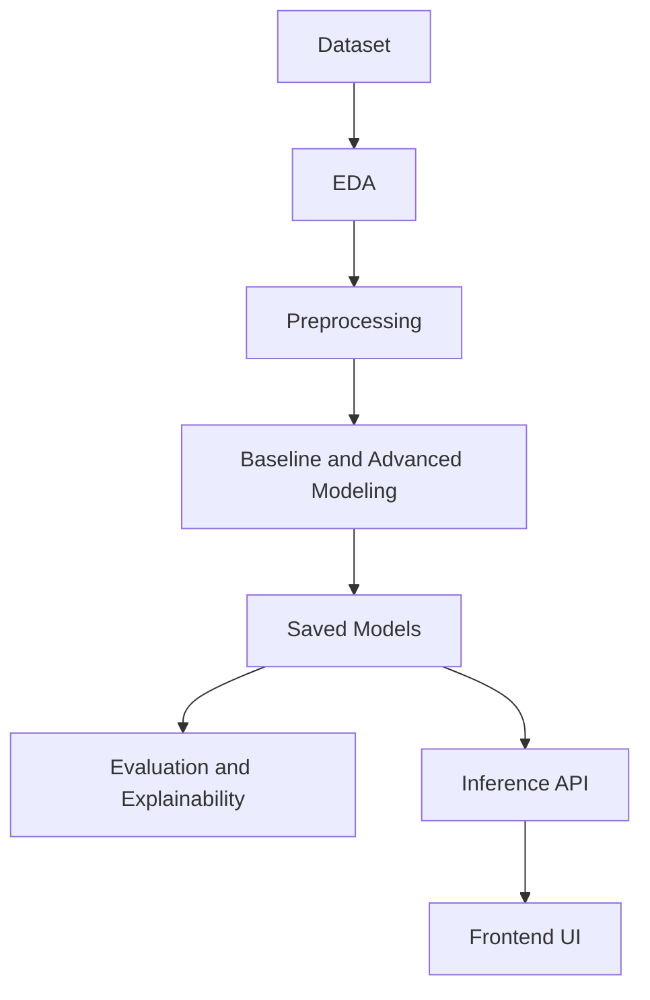

# ImpactSense

Earthquake impact prediction system with:
- End-to-end notebook workflow (EDA, preprocessing, training, explainability)
- Saved ML model artifacts
- Local Flask app option
- Vercel static frontend + serverless Python API deployment

## Project References

### Datasets and Prepared Data
- [earthquake_alert_balanced_dataset.csv](earthquake_alert_balanced_dataset.csv): Balanced source dataset for model development.
- [earthquake_processed.csv](earthquake_processed.csv): Processed feature dataset used by advanced training and evaluation notebooks.

### Notebook Workflow
- [earthquake_eda.ipynb](earthquake_eda.ipynb): Exploratory data analysis.
- [earthquake_preprocessing.ipynb](earthquake_preprocessing.ipynb): Feature engineering and preprocessing pipeline.
- [earthquake_baseline_modeling.ipynb](earthquake_baseline_modeling.ipynb): Baseline model experiments.
- [earthquake_advanced_modeling.ipynb](earthquake_advanced_modeling.ipynb): Advanced training, tuning, model comparison, and model saving.
- [earthquake_week5_evaluation_explainability.ipynb](earthquake_week5_evaluation_explainability.ipynb): Evaluation and explainability (uses saved models).

### Saved Models
Model artifacts generated in [saved_models](saved_models):
- [saved_models/rf_default.pkl](saved_models/rf_default.pkl)
- [saved_models/gb_default.pkl](saved_models/gb_default.pkl)
- [saved_models/xgb_default.pkl](saved_models/xgb_default.pkl)
- [saved_models/rf_best.pkl](saved_models/rf_best.pkl)
- [saved_models/gb_best.pkl](saved_models/gb_best.pkl)
- [saved_models/xgb_best.pkl](saved_models/xgb_best.pkl)
- [saved_models/gb_custom.pkl](saved_models/gb_custom.pkl)

### Web App and API References
- [UI/app.py](UI/app.py): Local Flask app (landing/login/predictor + tests).
- [UI/public/index.html](UI/public/index.html): Landing page for deployed static frontend.
- [UI/public/login.html](UI/public/login.html): Login screen.
- [UI/public/predictor.html](UI/public/predictor.html): Predictor UI that calls the API.
- [UI/public/favicon.ico](UI/public/favicon.ico): Site favicon.
- [UI/api/common.py](UI/api/common.py): Shared inference, input sanitization, and edge-case tests.
- [UI/api/predict.py](UI/api/predict.py): Serverless prediction endpoint.
- [UI/api/tests.py](UI/api/tests.py): Serverless edge-case test endpoint.
- [UI/api/health.py](UI/api/health.py): Health check endpoint.
- [vercel.json](vercel.json): Vercel build and route mapping.
- [requirements.txt](requirements.txt): Python dependency lock for app and serverless functions.

## Usage

### 1. Install Dependencies
Run from repository root:

		pip install -r requirements.txt

### 2. Notebook Pipeline Usage
Recommended order:
1. [earthquake_eda.ipynb](earthquake_eda.ipynb)
2. [earthquake_preprocessing.ipynb](earthquake_preprocessing.ipynb)
3. [earthquake_baseline_modeling.ipynb](earthquake_baseline_modeling.ipynb)
4. [earthquake_advanced_modeling.ipynb](earthquake_advanced_modeling.ipynb)
5. [earthquake_week5_evaluation_explainability.ipynb](earthquake_week5_evaluation_explainability.ipynb)

Exact output dependency:
- [earthquake_advanced_modeling.ipynb](earthquake_advanced_modeling.ipynb) writes model files to [saved_models](saved_models).
- [earthquake_week5_evaluation_explainability.ipynb](earthquake_week5_evaluation_explainability.ipynb) loads those files for evaluation and explainability.

### 3. Run Local Flask App
Run from repository root:

		python UI/app.py

Local pages:
- Landing: http://127.0.0.1:5000/
- Login: http://127.0.0.1:5000/login
- Predictor: http://127.0.0.1:5000/app
- Tests endpoint: http://127.0.0.1:5000/tests

Optional CLI test run:

		python UI/app.py --run-tests

### 4. Deploy on Vercel
Deployment uses [vercel.json](vercel.json) and repository root configuration.

Important:
- Keep the Vercel project root as repository root (do not change it to UI).
- Ensure [saved_models/gb_custom.pkl](saved_models/gb_custom.pkl) is present because prediction API loads this model.

After deployment, static routes:
- /
- /login
- /predictor

Serverless API routes:
- /api/health
- /api/tests
- /api/predict

## API Contract (Exact)

### POST /api/predict
Request JSON body fields:
- magnitude: number in 0 to 10
- depth: number in 0 to 700
- cdi: number in 0 to 12
- mmi: number in 0 to 12
- sig: number in 0 to 1200

Server behavior:
- Values are clamped to valid ranges.
- depth_mag_ratio is auto-derived as depth divided by max(magnitude, 0.01).

Example request:

		{
			"magnitude": 5.8,
			"depth": 18,
			"cdi": 4.5,
			"mmi": 4.1,
			"sig": 420
		}

Example success response:

		{
			"predicted_class": "yellow",
			"impact_score": 53.27,
			"risk_level": "Moderate",
			"probabilities": {
				"green": 18.12,
				"yellow": 45.66,
				"orange": 27.14,
				"red": 9.08
			},
			"features_used": {
				"magnitude": 5.8,
				"depth": 18.0,
				"cdi": 4.5,
				"mmi": 4.1,
				"sig": 420.0,
				"depth_mag_ratio": 3.1034
			},
			"target_color": "#f2c94c",
			"shake_class": "shake-light"
		}

Error response:

		{
			"error": "'sig' is required"
		}

### GET /api/tests
Runs built-in edge-case checks defined in [UI/api/common.py](UI/api/common.py) and returns:
- results: per-case pass/fail entries
- passed: overall boolean

### GET /api/health
Returns service heartbeat JSON:

		{
			"status": "ok",
			"service": "impact-predictor-api"
		}

## Notes
- The serverless API and local Flask app use the same input schema and prediction logic patterns.
- Current serverless model path is defined in [UI/api/common.py](UI/api/common.py) and points to [saved_models/gb_custom.pkl](saved_models/gb_custom.pkl).

## PPT Slides Content

Detailed version: [PPT_Slides_Content.md](PPT_Slides_Content.md)

### 1. Problem Statement
- Earthquake alerts are often difficult to interpret quickly in high-pressure response situations.
- Raw seismic parameters do not directly communicate operational risk severity.

### 2. Proposed Solution
- ML-based Earthquake Impact Predictor using seismic inputs.
- Outputs: predicted class, class probabilities, impact score, and risk level in a web UI.

### 3. Tech Stack
- Python, pandas, numpy, scikit-learn, xgboost, shap, joblib.
- Flask (local), Vercel serverless Python APIs, static HTML/CSS/JS frontend.

### 4. Work Flow Diagram

### 5. Feasibility Viability
- Feasible with completed data-to-deployment pipeline.
- Viable for lightweight hosting using static pages plus serverless inference.

### 6. Impact and Benefits
- Faster risk interpretation and better communication for operators.
- Robust behavior through validation, clamping, and edge-case tests.

### 7. Conclusion
- End-to-end system from data science workflow to live deployment.
- Live website link: https://your-vercel-project-url.vercel.app

## Project Document Content

Detailed version: [Project_Document.md](Project_Document.md)

### 1. The Problem
Earthquake reports contain technical indicators but do not directly provide user-friendly impact interpretation for rapid decisions.

### 2. Project Name
ImpactSense: Earthquake Impact Prediction System

### 3. Goal
Build a deployable system that predicts alert class and impact severity from seismic inputs.

### 4. Proposed Solution (Small Description)
Train and deploy multiclass ML models that transform seismic parameters into actionable risk outputs through a web interface.

### 5. Implementation (Weekly Tasks)

#### 5.1 Week 1
- Problem definition and project setup.

#### 5.2 Week 2
- EDA and understanding data patterns.

#### 5.3 Week 3
- Preprocessing and feature engineering.

#### 5.4 Week 4
- Advanced model training, tuning, comparison, and model saving.

#### 5.5 Week 5
- Evaluation and explainability with saved models.

#### 5.6 Week 6
- Web app development: landing, login, predictor UI.

#### 5.7 Week 7
- Edge-case testing and Vercel serverless deployment.

### 6. Tech Stack Used
- Frontend: HTML, CSS, JavaScript.
- Backend: Flask and Vercel serverless Python APIs.
- Models: Random Forest, Gradient Boosting, XGBoost.

### 7. Conclusion
ImpactSense provides a practical, maintainable earthquake impact decision-support system with clear outputs and deployable architecture.
