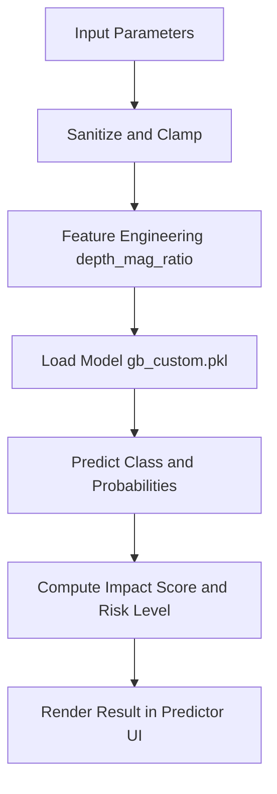

# Week 6 + Week 7 Combined: Impact Predictor UI Prototype

This prototype combines:
- Week 6: simple UI form for impact/risk prediction
- Week 7: edge-case testing and logic improvements

It uses the best-performing saved model from your previous evaluation run:
- `saved_models/gb_custom.pkl`

## Features
- Retro black-and-white UI theme
- Landing page and basic login flow (no authentication)
- Input validation + clamping for robust behavior
- Automatic `depth_mag_ratio` computation for consistent feature engineering
- Prediction outputs:
  - Predicted alert class (`green/yellow/orange/red`)
  - Impact score (0-100)
  - Risk level (`Low/Moderate/High/Severe`)
  - Class probability breakdown
- Predicted target class shown with its color badge
- Result panel shake intensity increases with risk level
- Built-in edge-case tests

## Run Locally (Flask)
From workspace root:

```powershell
python UI/app.py
```

Open:
- http://127.0.0.1:5000 (landing page)

Flow:
- Landing page: `/`
- Login page: `/login`
- Predictor app: `/app`

## Run Week 7 Edge-Case Tests

```powershell
python UI/app.py --run-tests
```

Or use endpoint:
- http://127.0.0.1:5000/tests

## Deploy on Vercel (Serverless Backend)

This repository now includes:
- Serverless Python endpoints in `UI/api/`
- Static frontend pages in `UI/public/`
- Vercel routing config in `vercel.json`
- Python dependencies in `requirements.txt`

### Serverless Endpoints
- `/api/health`
- `/api/predict` (POST JSON)
- `/api/tests`

### Deploy Steps
1. Push all changes to GitHub.
2. In Vercel, import the GitHub repository.
3. Keep project root as repository root (do not set it to `UI`).
4. Deploy.

After deploy, app pages are:
- `/`
- `/login`
- `/predictor`

## PPT Slides Content

Detailed version: [../PPT_Slides_Content.md](../PPT_Slides_Content.md)

### 1. Problem Statement
- Earthquake alerts are difficult to interpret quickly from raw seismic values.
- Non-specialist users need direct risk-level outputs.

### 2. Proposed Solution
- Predict earthquake alert class from seismic parameters using trained ML models.
- Serve predictions through a web UI with score, probabilities, and risk level.

### 3. Tech Stack
- Frontend: HTML, CSS, JavaScript in [public](public).
- Backend Local: Flask app in [app.py](app.py).
- Backend Deployment: Vercel serverless functions in [api](api).
- Models: scikit-learn and XGBoost artifacts in [../saved_models](../saved_models).

### 4. Work flow diagram


### 5. Feasibility viability
- Feasible: implemented and running locally and on serverless routes.
- Viable: low-cost static + serverless architecture.

### 6. Impact and Benefits
- Improves speed and clarity of earthquake impact interpretation.
- Provides robust behavior via validation and edge-case tests.

### 7. Conclusion (live website link should be there)
- The UI and API architecture is production-ready for lightweight deployment.
- Live website link: https://your-vercel-project-url.vercel.app

## Project Document Content

Detailed version: [../Project_Document.md](../Project_Document.md)

### 1. The problem
Raw earthquake inputs are technical and not directly actionable for quick response decisions.

### 2. Project name
ImpactSense: Earthquake Impact Prediction System

### 3. Goal
Deliver an end-to-end pipeline and deployable app for impact/risk prediction.

### 4. Proposed solution: small description
Use trained multiclass ML models to predict alert category and risk metrics from seismic parameters, exposed through local Flask and Vercel serverless APIs.

### 5. Implementation (weekly tasks)

#### 5.1 Week1
- Problem setup and requirement analysis.

#### 5.2 Week2
- Data exploration and feature analysis.

#### 5.3 Week3
- Preprocessing and model-ready dataset generation.

#### 5.4 Week4
- Training, tuning, and model artifact saving.

#### 5.5 Week5
- Evaluation and explainability using saved models.

#### 5.6 Week6
- UI development for landing/login/predictor.

#### 5.7 Week7
- Edge-case tests and deployment hardening.

### 6. Tech stack used ( front end and backend and models)
- Frontend: HTML/CSS/JS.
- Backend: Flask + Vercel Python serverless.
- Models: Random Forest, Gradient Boosting, XGBoost.

### 7. Conclusion
The project demonstrates a complete and feasible earthquake prediction decision-support system from notebook experiments to deployable UI and API.
